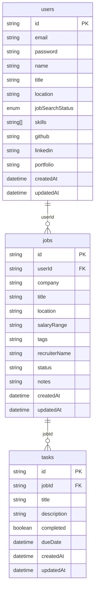

# Dev-Dash App

## ℹ️ General Info

This is a web application for tracking/searching jobs.

## 🏭 Application

This is a [Next.js](https://nextjs.org) project bootstrapped with [`create-next-app`](https://nextjs.org/docs/app/api-reference/cli/create-next-app).

_To work properly, fill in the **`.env`** file. Use the **`.env.example`** file as an example._

## 🖍 Requirements

- [NodeJS](https://nodejs.org/en/) (22.x.x);
- [NPM](https://www.npmjs.com/) (10.x.x);
- [PostgreSQL](https://www.postgresql.org/) (16.0)
- run **`npx simple-git-hooks`** at the root of the project, before the start (it will set
  the [pre-commit hook](https://www.npmjs.com/package/simple-git-hooks) for any commits).

## Getting Started

**Run the following commands _at root_**:

- `npm install`
- `docker compose up --build`
- `npm run dev`

Open [http://localhost:3000](http://localhost:3000) with your browser to see the result.

## 🏗 Architecture

### Database Schema:



### 🛖 Stack Overview

### 🌑 Backend

- [Next.js](https://nextjs.org/) — server‑side routes, API endpoints, and rendering.
- [Prisma](https://www.prisma.io/postgres) — type‑safe ORM for PostgreSQL.
- [PostgreSQL](https://www.postgresql.org/) — primary database.
- [NextAuth](https://next-auth.js.org/) — authentication and session management.

### 🌕 Frontend

- [React](https://react.dev/) — UI library.
- [Tailwind](https://tailwindcss.com/) — utility‑first styling.
- [React-Hook-Form](https://react-hook-form.com/?utm_source=copilot.com) - form handling.

### 🥊 Code quality

- [simple-git-hooks](https://www.npmjs.com/package/simple-git-hooks) — a tool that lets you easily manage git hooks.
- [lint-staged](https://www.npmjs.com/package/lint-staged) — run linters on git staged files.
- [dangerjs](https://danger.systems/js/) — automate common code review chores.
- [commitlint](https://commitlint.js.org/) — helps your team adhere to a commit convention.
- [editorconfig](https://editorconfig.org/) — helps maintain consistent coding styles for multiple developers working on
  the same project across various editors and IDEs.
- [prettier](https://prettier.io/) — an opinionated code formatter.
- [ls-lint](https://ls-lint.org/) — file and directory name linter.
- [eslint](https://eslint.org/) — find problems in your JS code.
- [stylelint](https://stylelint.io/) — find and fix problems in your CSS code.

## 🧑‍💻 CI

### 🗞 Git

#### 🏅 Pull Request flow

```
<type>: <ticket-title> <project-prefix>-<issue-number>
```

For the full list of types check [Conventional Commits](https://github.com/conventional-changelog/commitlint/tree/master/%40commitlint/config-conventional)

##### Example

- `feat: + add dashboard screen ir-20`

#### 🌳 Branch flow

```
<issue-number>-<type>-<short-desc>
```

##### Examples

- `14-feat-add-dashboard`
- `12-feat-add-user-flow`
- `34-fix-user-flow`

#### 🗂 Commit flow

We use [Conventional Commits](https://www.conventionalcommits.org/en/v1.0.0/) to handle commit messages

```
<type>: <description> <project-prefix>-<issue-number>
```

##### Examples

- `feat: + dashboard component dd-5`
- `fix: * update dashboard card size dd-2`

## 📦 CD

[Handled](.github/workflows/cd.yml) by [GitHub Actions](https://docs.github.com/en/actions).
